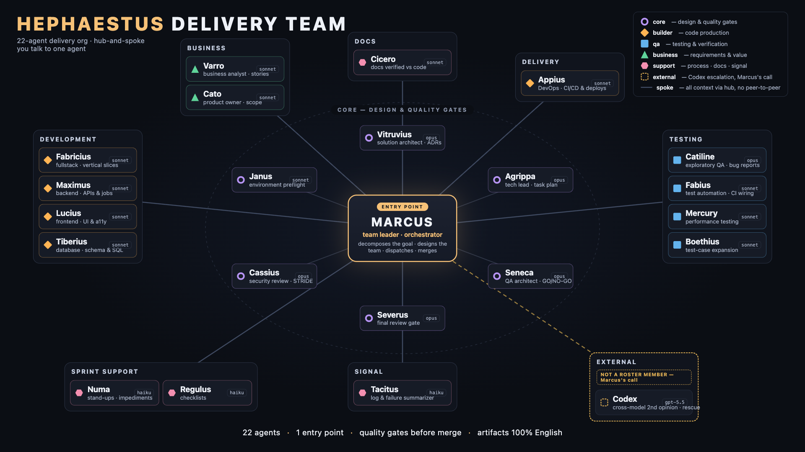

# Agent teams — Hephaestus (delivery) + Argus (QA)

**49 Claude Code sub-agents** in two themed teams, plus Codex-format variants for both teams:

- **Hephaestus** (`hephaestus/`) — **22 agents**, software delivery, **Roman names**. Entry point: **Marcus** (Team Leader). Available in both Claude Code and Codex formats.
- **Argus** (`argus/`) — **27 agents**, permanent QA team, **Greek names**. Claude entry point: the packaged **`argus-launch`** launcher, which starts the `/argus:run` main thread under the Odysseus policy; Codex entry point: **Odysseus** (dispatch currently fails closed). Available in both formats.

> **This repo is a Claude Code plugin marketplace** (`holak-teams`). Install the teams as plugins:
> ```
> /plugin marketplace add holi87/holak-teams
> /plugin install hephaestus@holak-teams
> /plugin install argus@holak-teams
> ```
> Start Argus from a terminal with the packaged launcher:
> `argus-launch doctor --browser`, then `argus-launch claude --target … --artifact-root … --mode <A|B|C|D> --engagement-id …`
> (full sequence in **[INSTALL.md](INSTALL.md)** → "Start Argus"). A direct `/argus:run` session fails preflight.
> Canonical repo + marketplace doc: **[AGENTS.md](AGENTS.md)** (mirrored as `CLAUDE.md`). Manual / Codex install: **[INSTALL.md](INSTALL.md)**. Release gate: **[RELEASE.md](RELEASE.md)**.

You tell **Marcus** what you want — he picks people from the roster, names them, splits up the work, merges results. For a QA / testing / bug-hunt engagement, `argus-launch` starts `/argus:run` as the sandboxed main Claude Code thread, which applies **Odysseus** as the policy, dispatches the Argus lanes, and collects their results. Claude Code agent defs live under each team's `claude/agents/` (the plugin root is `claude/`); Codex-compatible variants live under each team's `codex/` with the same names and slugs.

## Team graphs

| Hephaestus — delivery (22) | Argus — QA (27) |
|---|---|
| [](hephaestus/team-graph.html) | [](argus/team-graph.html) |

Both graphs ship as self-contained HTML (`<team>/team-graph.html`) — open locally for the full-screen / print version.

## How it works

```
USER → Marcus (Team Leader) → picks agents → names them → dispatch → merge → report to USER
                                  ↑ hub-and-spoke: agents do NOT talk to each other, everything goes through Marcus
```

- **You call Marcus**, not individual agents (though you can call any of them directly).
- Marcus breaks the goal into tasks, picks roles, and **names the instances** by the letter convention.
- When you need **several of the same role in parallel** — each gets a different name from the letter pool so you can tell them apart.
- Dual-path dispatch: if Marcus can spawn (the `Task` tool) → he spawns; if not → he emits a delegation plan in a strict format for you to execute.
- **Execution contracts:** every worker ends with a RESULT envelope (`STATUS: COMPLETE|PARTIAL|BLOCKED|UNVERIFIED / EVIDENCE / ARTIFACTS / DOCS IMPACT / OPEN ITEMS / LESSONS`); parallel tasks have disjoint file-sets; every coding plan ends with a RUN gate (Fabius/Catiline actually runs it with output); a failed gate → repair protocol (max 2 cycles → escalate tier/Codex → BLOCKED); destructive/push lines marked `⛔ CONFIRM` require the user's approval.

## Repo structure

```
holak-teams/                     # this git repo == the marketplace
├── .claude-plugin/
│   └── marketplace.json         # catalog — source: ./hephaestus/claude, ./argus/claude
├── .claude/settings.json        # auto-register marketplace + enable both plugins
├── AGENTS.md  CLAUDE.md->AGENTS.md   # canonical doc + symlink
├── hephaestus/                  # delivery team (Roman names)
│   ├── claude/                  # == PLUGIN ROOT (Claude only)
│   │   ├── .claude-plugin/plugin.json
│   │   └── agents/              # 22 flat agent defs (marcus, vitruvius, …)
│   ├── codex/                   # 22 Codex-format agents (*.toml + *.md) — separate
│   ├── team-graph.html + .png   # visual team graph (embedded in README)
│   └── README.md                # how to start (entry: marcus)
├── argus/                       # Argus QA team (Greek names)
│   ├── claude/                  # == PLUGIN ROOT (Claude only)
│   │   ├── .claude-plugin/plugin.json
│   │   ├── agents/              # 27 flat agent defs (odysseus, orion, …)
│   │   ├── skills/run/SKILL.md  # /argus:run main-thread orchestrator
│   │   ├── skills/qa-*/         # capability-selected QA profiles
│   │   ├── skills/orchestration-core/ # complete controller contract
│   │   ├── skills/competition-profile/ # explicit opt-in profile
│   │   ├── bin/argus-launch     # supported entry point (signed launch + OS sandbox)
│   │   ├── bin/argus-assets     # verify/copy packaged assets
│   │   ├── hooks/hooks.json     # packaged target-immutability guard
│   │   ├── capabilities/        # 27-role runtime capability + fallback matrix
│   │   ├── policies/ + lib/     # deny-by-default authorization + redaction runtime
│   │   ├── references/ + schemas/
│   │   └── templates/           # installed TS / Java / Python framework copies
│   ├── codex/                   # 27 Codex-format agents (*.toml + *.md) — separate
│   ├── roles/                   # canonical Argus role content, metadata, runtime adapters
│   ├── framework-template/      # prepped Playwright+TS framework (shared reference)
│   ├── framework-template-java/   # RestAssured + JUnit5 + Playwright-Java (shared reference)
│   ├── framework-template-python/ # pytest + Playwright + httpx (shared reference)
│   ├── framework-template-common/ # shared runner kit, synced into each template
│   ├── AUTHORIZATION-POLICY.md   # canonical authorization and redaction contract
│   ├── ENGAGEMENT-POLICY.md      # canonical concurrency and ownership contract
│   ├── MODEL-POLICY.md           # generated model/effort/turn/escalation table
│   ├── model-policy*.json        # canonical source + synthetic benchmark evidence
│   ├── policies/ + runtime/      # canonical policy data + evaluator sources
│   ├── COLOR-SCHEME.md          # colors by role type
│   ├── shared-skills/           # canonical capability-scoped skill sources
│   ├── prompt-*.json            # prompt budgets + engagement regression contract
│   ├── team-graph.html + .png   # visual team graph (embedded in README)
│   └── README.md                # how to start (entry: argus-launch)
├── agents-roster.html           # visual roster (both teams)
└── README.md / INSTALL.md
```

Agent slug = file name without `.md` (bare first name, e.g. `marcus`, `odysseus`). Claude Code requires plugin agents to be **flat** inside `agents/` (no subdirectories), so the old `dev/`/`QA/`/`ba/`/`management/` grouping is now a flat list under `hephaestus/claude/agents/`. For Codex, both teams keep the same bare slugs in paired files such as `hephaestus/codex/marcus.toml` + `hephaestus/codex/marcus.md` or `argus/codex/odysseus.toml` + `argus/codex/odysseus.md`.

## Roster

<!-- keep in sync with marcus.md §Roster (canonical) -->

| Name | Role | Slug (to spawn) | Model | Category | Letter |
|------|------|------|------|------|:--:|
| Marcus | Team Leader & Orchestrator | `marcus` | opus | orchestration | M |
| Vitruvius | Solution Architect | `vitruvius` | opus | code production | K |
| Agrippa | Tech Lead | `agrippa` | opus | code production | K |
| Severus | Final Code Reviewer | `severus` | opus | code production | K |
| Fabricius | Fullstack Developer | `fabricius` | sonnet | code production | K |
| Seneca | QA Architect | `seneca` | opus | testing | T |
| Cassius | Security Reviewer | `cassius` | opus | testing | T |
| Varro | Business Analyst | `varro` | sonnet | business | B |
| Cato | Product Owner | `cato` | sonnet | business | B |
| Maximus | Backend Developer | `maximus` | sonnet | code production | K |
| Lucius | Frontend Developer | `lucius` | sonnet | code production | K |
| Tiberius | Database Developer | `tiberius` | sonnet | code production | K |
| Fabius | Automation QA | `fabius` | sonnet | testing | T |
| Catiline | QA Engineer | `catiline` | opus | testing | T |
| Mercury | Performance Tester | `mercury` | sonnet | testing | T |
| Boethius | Test Case Expander | `boethius` | sonnet | testing | T |
| Appius | DevOps Engineer | `appius` | sonnet | process | P |
| Janus | Environment Preflight | `janus` | sonnet | process | S* |
| Numa | Scrum Master Assistant | `numa` | haiku | process | P |
| Regulus | Checklist Generator | `regulus` | haiku | process | P |
| Cicero | Documentation Assistant | `cicero` | sonnet | other | G |
| Tacitus | Log Summarizer | `tacitus` | haiku | other | G |

## Naming convention

Names are **only a display layer** for building teams — they let you tell instances apart. They do not change an agent's role or behavior.

**Theme by team:** **Hephaestus = Roman/Latin** names (Marcus, Vitruvius, Severus…), **Argus = Greek** names (Odysseus, Atalanta, Lynceus…). Each name is picked to fit the role, not a rigid first-letter rule.

**The one hard rule:** within a single team, every member has a **unique name**. If Marcus picks e.g. 3× Fullstack Developer → 3 different names (e.g. Fabricius, Cassia, Drusus), never two with the same name.

Example pools (Marcus extends freely, keep the team's theme):

- **Hephaestus (Roman):** Brutus, Cassia, Flavia, Octavia, Gaius, Quintus, Drusus, Aulus, Decimus, Valeria, Cornelia, Crispus.
- **Argus (Greek):** Helena, Iris, Hektor, Nestor, Kassandra, Phoebe, Leto, Theron, Lysander, Daphne.

> The roster table's **Letter** column (K/T/P/B/G/M, S\* for Janus) is a **legacy category code** (code-production / testing / process / business / other) — a grouping hint only. The ancient names no longer start with that letter.

## Models

- **Opus** (7) — two bands:
  - *unfiltered judgment* — Marcus, Vitruvius, Seneca, Severus: decisions NOT FILTERED by a subsequent gate (orchestration/decomposition, one-way-door architecture, GO/NO-GO verdicts, the final gate before merge). Here a judgment error cascades across the whole team's work (the AcademyBugs 0/25 lesson = a planning error, not an execution one).
  - *heavy cross-cutting work* — Agrippa, Cassius, Catiline: security, exploratory QA, tech-lead judgment.
- **Sonnet + escalation to Opus** (12): Varro, Fabricius, Maximus, Lucius, Tiberius, Fabius, Boethius, Mercury, Cato, Appius, Janus, Cicero — daily work; flag hard/risky decisions for review by Marcus.
- **Haiku** (3): Numa, Regulus, Tacitus — fast, narrow, cheap tasks.

The above is the **main team (22)**. **Argus QA (27)** is a separate, permanent QA team with a generated 27 frontier / 0 standard policy from `argus/model-policy.json`.

**Codex runtime mapping for both teams:** Claude `opus` source roles run on `sol` with `model_reasoning_effort = "xhigh"`; Claude `sonnet` source roles run on `terra` with `model_reasoning_effort = "medium"`; Claude `haiku` source roles run on `luna` with `model_reasoning_effort = "medium"`.

The mapping and generated role-body/configuration alignment are enforced for all 49 agents. Hephaestus Codex
files are generated from `hephaestus/claude/agents/*.md`; Argus runtime variants are
generated from `argus/roles/`. `scripts/smoke-agent-runtime-parity.sh` checks both native
configuration loaders plus this roster and the HTML roster. That load check is not a
behavioral-equivalence test: Argus Codex support is `parent-runtime-dependent` and needs
parent-provided orchestration, packaged assets, and equivalent tools. See
[`AGENT-RUNTIME-PARITY.md`](AGENT-RUNTIME-PARITY.md) for the latest audit result.

## Full roster — model per runtime

Every agent runs on an **Anthropic** model under Claude Code and on a **mapped OpenAI** model under Codex — **Codex never uses Anthropic models.** The mapping is fixed by source tier: `opus → sol · xhigh`, `sonnet → terra · medium`, `haiku → luna · medium`. The `· value` after the Codex model is `model_reasoning_effort`.

### Hephaestus — delivery (22)

| Name | Slug | Role | Claude (Anthropic) | Codex (OpenAI) |
|------|------|------|------|------|
| Marcus | `marcus` | Team Leader & Orchestrator | opus | sol · xhigh |
| Vitruvius | `vitruvius` | Solution Architect | opus | sol · xhigh |
| Agrippa | `agrippa` | Tech Lead | opus | sol · xhigh |
| Severus | `severus` | Final Code Reviewer | opus | sol · xhigh |
| Seneca | `seneca` | QA Architect | opus | sol · xhigh |
| Cassius | `cassius` | Security Reviewer | opus | sol · xhigh |
| Catiline | `catiline` | QA Engineer | opus | sol · xhigh |
| Fabricius | `fabricius` | Fullstack Developer | sonnet | terra · medium |
| Maximus | `maximus` | Backend Developer | sonnet | terra · medium |
| Lucius | `lucius` | Frontend Developer | sonnet | terra · medium |
| Tiberius | `tiberius` | Database Developer | sonnet | terra · medium |
| Varro | `varro` | Business Analyst | sonnet | terra · medium |
| Cato | `cato` | Product Owner | sonnet | terra · medium |
| Fabius | `fabius` | Automation QA | sonnet | terra · medium |
| Mercury | `mercury` | Performance Tester | sonnet | terra · medium |
| Boethius | `boethius` | Test Case Expander | sonnet | terra · medium |
| Appius | `appius` | DevOps Engineer | sonnet | terra · medium |
| Janus | `janus` | Environment Preflight | sonnet | terra · medium |
| Cicero | `cicero` | Documentation Assistant | sonnet | terra · medium |
| Numa | `numa` | Scrum Master Assistant | haiku | luna · medium |
| Regulus | `regulus` | Checklist Generator | haiku | luna · medium |
| Tacitus | `tacitus` | Log Summarizer | haiku | luna · medium |

**Tiers:** 7 opus · 12 sonnet · 3 haiku.

### Argus — QA (27)

| Name | Slug | Role | Claude (Anthropic) | Codex (OpenAI) |
|------|------|------|------|------|
| Odysseus | `odysseus` | Team Lead & Orchestrator (entry) | opus | sol · xhigh |
| Kalchas | `kalchas` | System Analyst (recon) | opus | sol · xhigh |
| Metis | `metis` | Test Strategist | opus | sol · xhigh |
| Minos | `minos` | Bug Triage / QA Lead | opus | sol · xhigh |
| Kleio | `kleio` | QA Reporter | opus | sol · xhigh |
| Theseus | `theseus` | API test-path analyst | opus | sol · xhigh |
| Penelope | `penelope` | UI test-path analyst | opus | sol · xhigh |
| Pistis | `pistis` | Consumer-driven contract analyst (Pact) | opus | sol · xhigh |
| Atalanta | `atalanta` | API / data-integrity hunter | opus | sol · xhigh |
| Proteus | `proteus` | Multi-protocol API hunter (GraphQL/gRPC/WS/async) | opus | sol · xhigh |
| Orion | `orion` | UI functional hunter | opus | sol · xhigh |
| Lynceus | `lynceus` | UI presentation / i18n hunter | opus | sol · xhigh |
| Ariadne | `ariadne` | Deep-journey / business-rule hunter | opus | sol · xhigh |
| Hermes | `hermes` | Performance hunter (structural oracles) | opus | sol · xhigh |
| Tyche | `tyche` | Resilience / chaos hunter (fault injection) | opus | sol · xhigh |
| Perseus | `perseus` | Security hunter (STRIDE/OWASP) | opus | sol · xhigh |
| Antigone | `antigone` | Accessibility hunter (WCAG 2.2 AA) | opus | sol · xhigh |
| Charon | `charon` | Database hunter *(gated: DB access)* | opus | sol · xhigh |
| Tiresias | `tiresias` | White-box source analyst *(gated: source)* | opus | sol · xhigh |
| Atlas | `atlas` | Automation Architect (harness, run-tests.sh) | opus | sol · xhigh |
| Aristarchus | `aristarchus` | Automation code reviewer (runs LAST) | opus | sol · xhigh |
| Asklepios | `asklepios` | Test-suite sanitation / deflaking (brownfield) | opus | sol · xhigh |
| Talos | `talos` | API regression automation | opus | sol · xhigh |
| Daidalos | `daidalos` | UI E2E + a11y automation | opus | sol · xhigh |
| Aegis | `aegis` | Security regression automation | opus | sol · xhigh |
| Nike | `nike` | Perf regression automation | opus | sol · xhigh |
| Mnemosyne | `mnemosyne` | DB invariants automation *(gated)* | opus | sol · xhigh |

**Tiers:** 27 opus · 0 sonnet · 0 haiku full roles.

## Preflight and escalation to Codex

- **Janus (Environment Preflight)** — when the goal depends on external tooling (a specific MCP, CLI, auth, service, plugin), Marcus places him **at the start of the plan**: he verifies the environment can actually carry the work (*configured ≠ working* — he checks `claude mcp list` for health, that the CLI is logged in, that services are up). He returns a verdict READY / READY-WITH-GAPS / NOT READY + blocking/non-blocking gaps + a remediation command. **He only diagnoses** — the fix goes to Appius (DevOps) or to you via Marcus. The name `S*` = an exception outside the letter convention (like Marcus = M).
- **Codex** (`codex:codex-rescue`, GPT-5.x, write-capable) — the only sanctioned external resource outside the roster (not a persona, gets no name). Marcus dispatches it deliberately for: one-way-door architecture decisions (a cross-model second opinion), a stuck root-cause, or a heavy implementation pass to compare against. **Vitruvius and Agrippa may RECOMMEND it** in their results — the decision to invoke is Marcus's. Escalation does not bypass quality gates (Severus/Cassius/tests still apply).

## Artifact language

All files produced by the agents (documents, reports, strategies, bug reports, checklists, code, comments, test names, commits) are **100% in English** — regardless of the conversation language. Polish only in chat with the user. Argus receives the rule from its universal `qa-core` profile; Hephaestus keeps it inline.

## Team memory and learning

The team is **cross-project** (a global install, many repos). Memory is split into layers, with no separate store (so it doesn't rot or duplicate claude-mem):

- **Role memory = its own prompt** (`<role>.md`). Global, cross-project, auto-loaded for free every run. This is where the role's durable learning is distilled — through deliberate prompt edits (which is what we do in this walkthrough).
- **Project memory = `AGENTS.md`/`CLAUDE.md`** in the repo. Auto-loaded into every agent. This is where a specific project's conventions and gotchas land.
- **Run state = `.marcus/state.md`** — Marcus's lightweight log (team, decisions, who delivered what).

**Learning loop:** an agent emits `Lessons` in its result tagged `[project]` (→ AGENTS.md) or `[craft]` (→ a candidate to distill into the role prompt). Marcus/you curate it — `[craft]` is promoted **deliberately and with verification**, never automatically (a rule from one stack misleads in another). Your session memory (claude-mem) catches the emits anyway for later search.

**Anti-rot rule:** the current code and task always beat a remembered rule. Evidence beats memory.

## A note on categories (re-lettering)

Three assignments are judgment calls — if they don't suit you, changing them = renaming the file and the table entry:

- **Cassius (Security Reviewer) → T** (testing/quality). Alternative: G (other).
- **Severus (Final Code Reviewer) → K** (code pipeline). Alternative: T (testing).
- **Appius (DevOps) → P** (delivery process). Alternative: K or G.

## Argus QA team

A second, **separate**, **permanent** QA team (**27 agents**) you point at any target — a live site, an API, a docker stack, a repo with or without tests. Run `argus-launch claude … --mode <A|B|C|D>` from a terminal; it starts the `/argus:run` main thread, which applies **Odysseus's** orchestration policy, dispatches the specialists, and collects their results: **A** full QA audit · **B** deep bug-hunt · **C** build a test suite from scratch · **D** add/extend tests in an existing repo (adopt-or-build). A direct `/argus:run` or `claude --agent argus:odysseus` session fails preflight. Files in `argus/claude/agents/`, slugs = bare first names (`odysseus`, `orion`, `lynceus`, `ariadne`, …). The crew is reused across engagements.

**v2 architecture = parallel `surface × mode` lanes.** Odysseus fires the lanes IN PARALLEL (UI / API / Performance / Database / CyberSecurity / Accessibility / deep journeys); each lane = a hunter (manual/exploratory) + an automation engineer + (UI/API) a path-analyst (baseline) where applicable. The 8→27 restructuring driver: a single generalist caught ~60% of API bugs but only ~14% of UI ones — dedicated lanes fix that. **Doctrine: `argus/BROWSER-ISOLATION.md` for isolated UI driving and the per-agent hardening blocks embedded in the Argus QA defs.** Colors by role type: `argus/COLOR-SCHEME.md`.

**Core (5, A-names — orchestration and gates):**

| Name | Role | Slug | Deliverable / function |
|------|------|------|------|
| Odysseus | Argus QA Team Lead & Orchestrator | `odysseus` | picks the engagement mode, fires the lanes IN PARALLEL, mode-scoped deliverable contract, no-modify-app, heartbeat board; full authority over the roster during the engagement |
| Kalchas | System Analyst (recon) | `kalchas` | system map (OpenAPI + docs + roles/data) + `solution/discovery/capability-evidence.json` (source-access / existing-suite / non-rest-surface proof that releases conditional lanes; DB access comes only from an operator `--feature`) + an inventory of mutating actions |
| Metis | Test Strategist | `metis` | `solution/TEST-STRATEGY.md` — an ISO 25010 × ISTQB coverage grid, lane assignment, BVA/credential/idempotency as required targets |
| Minos | Bug Triage / QA Lead | `minos` | dedup ACROSS lanes, severity/priority, ranking; assigns the canonical **`BUG-NNNN`** (lane-prefix → origin) |
| Kleio | QA Reporter | `kleio` | README + `IMPLEMENTATION-REPORT.md`, the found-vs-surface completeness gate (required rows = NOT-GO when empty) |

**`surface × mode` lanes (17 — repurposed A-core + the D-team):**

| Lane | Hunter (manual) | Automation | Path-analyst (baseline) |
|------|------|------|------|
| **API** | Atalanta *(REST/data)* + Proteus *(GraphQL/gRPC/WS/async)* | Talos | Theseus + Pistis *(consumer-driven contract)* |
| **UI** | Orion *(behaviour)* + Lynceus *(presentation/format/locale)* | Daidalos | Penelope |
| **Accessibility** | Antigone | Daidalos *(a11y autos)* | — |
| **Performance** | Hermes | Nike | — |
| **CyberSecurity** | Perseus *(has Write)* | Aegis | — |
| **Database** *(gated: DB access)* | Charon | Mnemosyne | — |
| **Resilience** *(chaos / fault injection)* | Tyche | Nike *(perf/resilience)* | — |

**Cross-cutting / deep journey (5):** **Ariadne** — deep lifecycle & business-rule journey hunter · **Atlas** — Automation Architect, owner of the SINGLE aggregating `run-tests.sh` + the shared oracle helpers · **Aristarchus** — Code Reviewer of the automation, runs **LAST** (determinism, oracle-honesty, blocklist) · **Tiresias** — White-box Source Analyst *(gated: source access)*, code→surface leads to the lanes · **Asklepios** — Test-Suite Sanitation / deflaking, heals a sick existing suite (brownfield Mode D), fixes flakiness at the source.

Current Argus QA policy: **27 opus / 0 sonnet / 0 haiku full roles**. The generated [model policy](argus/MODEL-POLICY.md) is the single cross-runtime view of native models, effort, maximum turns, escalation, fallback, downgrade guards, telemetry, and benchmark evidence. Worker prompts contain no opposite-runtime model narrative; the role-variant generator resolves each runtime from that policy. Colors by role type (cyan=core, red=hunter, green=automation, yellow=path-analyst, purple=cross) remain in `argus/COLOR-SCHEME.md`.

**Separation:** a separate lead (Odysseus = the Argus QA hub), baked-in QA doctrine (modes/deliverables/paths/rules), a separate `argus/` directory. **Collaboration:** the crew resolves within its own lanes (it has dedicated UI/API/Perf/DB/Sec/a11y) — the main team is pulled in only for a real gap and only via Odysseus→Marcus (e.g. Cassius=deep security, Maximus/Fabricius=wiring in the framework, Seneca=strategy sanity). **The hard rule baked into everyone:** NEVER modify the application under test.

**Capability-based framework template:** `argus-assets template detect` inventories the target language, framework, runner, package manager, source/test roots, and CI. `template select` requires an explicit runtime and layout choice. Existing suites return `action=adapt` and keep their conventions; greenfield `action=build` selections can be scaffolded into arbitrary test/harness roots. The TypeScript template remains a layered **Playwright + TS (API + UI)** framework with one `run-tests.sh`, native reports, solution documents, traceability, and bug-ledger gates, but its internal `src/` and `tests/` directories are relocatable placeholders rather than target assumptions. All templates share runner modes, evidence/results, tags, one-attempt execution, and expiring quarantine semantics.

**Other-stack templates:** the same doctrine ships in two sibling skeletons — `argus/framework-template-java/` (RestAssured + JUnit5 + Playwright-Java) and `argus/framework-template-python/` (pytest + Playwright + httpx). Both are **no-Selenium**, share the same result/evidence/quarantine contract, and relocate their test/harness roots from the explicit selection. Maven and pip are shipped build adapters; Gradle, uv, Poetry, and other detected tools are declared extension requirements rather than silently replaced.

**Starting an engagement** (from a terminal, not from inside a Claude Code session):
```
argus-launch claude --target <URL or absolute repo path> --artifact-root <absolute path> \
  --mode <A|B|C|D> --engagement-id <id> <signer flags or --unattested>
```
`argus-launch` → `/argus:run` under the Odysseus policy → preflight → recon and gate resolution → strategy/oracles → bug hunt and proof loop → automation → finalization. Watch live progress: `tail -f <artifact-root>/ai_agents_internal/heartbeat/*.log`.

## Invocation

```
> Marcus, build a REST API for task management with tests and CI.
```

Marcus will pick e.g. Vitruvius (architecture), Maximus (backend), Tiberius (database), Fabius (tests), Appius (CI), Severus (review) and report back to you who did what.

Global install → **INSTALL.md**.
