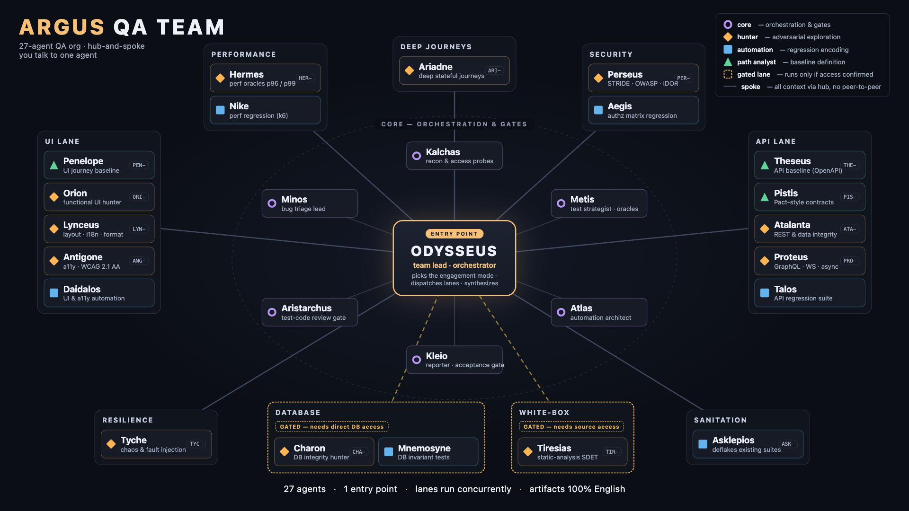

# Argus — QA Team

Greek code names. Black-box hunting + regression automation in a single pass.

[](team-graph.html)

*One supported entry point (`argus-launch`, which starts the `/argus:run` main thread), Odysseus orchestration policy, hub-and-spoke parallel surface × mode lanes — full-screen / print version: [`team-graph.html`](team-graph.html) (open locally in a browser).*

## How to start

**Supported entry point: `argus-launch`**

After installing the marketplace plugin, launch the skill through its native enforcement
wrapper:

```bash
argus-launch doctor --browser
argus-launch claude --target /absolute/target --artifact-root /absolute/artifacts --mode A \
  --engagement-id qa-001 --trust-store /secure/model-trust.json --runtime-key-id runtime-2026 \
  --operator-key-id operator-2026 --request-output /secure/qa-001.request.json \
  --launch-authorization /secure/qa-001.authorization.json --provision-browser --environment test
```

The launcher emits one immutable request and waits for the isolated runtime-attestation
signer described in `INSTALL.md`. The signer reviews and signs the exact request; no private
key or generic signing service enters the launcher or agent boundary. URL-only targets are
supported, with the artifact root as the default workspace. Hosts without Ed25519 keys can
replace the five signer flags with the explicit `--unattested` opt-in; every report then
names the engagement UNATTESTED (see `INSTALL.md`). The launch config holds no stored login:
export `ANTHROPIC_API_KEY` or a `claude setup-token` `CLAUDE_CODE_OAUTH_TOKEN` first.

Claude runs with `--permission-mode dontAsk --allowedTools <declared tool union>`. The
packaged write guard and OS sandbox enforce each call from every workspace; unattested
launches export `ARGUS_LAUNCH_ARTIFACT_ROOT` to bind the guard to the engagement.

Optional host flags, none of them signed or able to widen authorization:
`--provision-browser` prepares a Playwright runtime outside the artifact root before the
sandbox starts; `--authorization <absolute-path>` or `--environment
<local|test|staging|production>` installs the authorization manifest before preflight;
`--feature <capability-id>` declares capabilities such as `db-access` that the sandbox cannot
observe; `--usage-json <absolute-path>` saves Claude's final usage and turn report.
`argus-launch probe-browser` and `doctor --browser` test headless Chromium inside the sandbox
policy `os-native-target-readonly@3`. `INSTALL.md` → "Start Argus" documents every flag.

The main thread loads Odysseus's orchestration policy and does the rest:

1. reads the target, picks the **engagement mode**,
2. preflights the `Agent` tool and installed `argus:<slug>` specialists,
3. dispatches the crew in parallel in a **surface × mode** layout (UI / API / perf / security / a11y / DB-gated / white-box-gated),
4. collects specialist results and lands the mode's deliverable contract (reports + regression).

You do not call individual hunters by hand. The main thread owns dispatch and synthesis;
specialists return results only to it. If the target is missing, `Agent` delegation is
denied, or the plugin agents are unavailable, the command stops with an actionable
`ARGUS_PREFLIGHT_ERROR` and never claims that execution occurred.

The signed request binds the engagement, normalized target, physically disjoint artifact
root, workspace, launcher and Claude hashes, model, effort, mode, native 400-turn cap, and
sandbox policy.
The launcher then passes a one-shot random inherited capability, an exact four-variable
Argus environment, and the verified receipt into an OS sandbox whose only writable root is
the alias-free artifact boundary. Direct `/argus:run`, copied authorization files,
`claude --agent argus:odysseus`, and `@argus:odysseus` sessions fail preflight because they
cannot prove that complete execution envelope.

## Packaged runtime assets

Coverage is derived from the discovered target rather than universal test or defect
counts. `argus-assets coverage validate|calculate` consumes the canonical UI/API/event/data
surface inventory and execution observations, then emits separate discovery, risk-weighted
execution, assertion, evidence, scope, and defect-neutral outcome metrics. The installed
contract is available through `argus-assets path coverage-contract`.

Marketplace installs are self-contained. The plugin ships:

- `${CLAUDE_PLUGIN_ROOT}/skills/orchestration-core/` plus capability-selected `qa-*` profiles — complete policy without loading irrelevant role modules;
- `${CLAUDE_PLUGIN_ROOT}/skills/competition-profile/` — an explicit opt-in adapter that is disabled and never preloaded by default;
- `${CLAUDE_PLUGIN_ROOT}/references/` — browser isolation, authorization, engagement coordination, RACI, runner, coverage, template, and canonical ownership contracts;
- `${CLAUDE_PLUGIN_ROOT}/capabilities/` — the mode-aware capability matrix, orchestration plan, technique-catalog bundle, and generated model policy and sanitized benchmark;
- `${CLAUDE_PLUGIN_ROOT}/policies/` + `lib/` — authorization/engagement templates, redaction patterns, guards, and atomic controllers;
- `${CLAUDE_PLUGIN_ROOT}/hooks/hooks.json` — active `PreToolUse` target-immutability guard;
- `${CLAUDE_PLUGIN_ROOT}/schemas/` — runtime, engagement, canonical QA-contract, and browser-driver schemas;
- `${CLAUDE_PLUGIN_ROOT}/templates/` — TypeScript/Playwright, Java, and Python framework templates plus the shared `common/` runner kit;
- `argus-assets` — a PATH executable that verifies/copies assets, provisions the host browser runtime, preflights, authorizes, guards writes, coordinates parallel state, and redacts evidence.

The `argus-assets` verbs added in 5.0 are `browser provision` (host-only, run by
`argus-launch --provision-browser`), `authorization verify|install` (host-only, run by the
launcher for `--authorization`/`--environment`), `engagement resolve-gates`, `engagement
report-facts`, `engagement lane-outcomes`, the controller batch forms (`engagement allocate
--lanes`, `model route --agents`, batch barrier arrival, telemetry, and cleanup),
`automation-review digest|check`, `orchestration plan`, and `copy-runner-kit`. Run
`argus-assets --help` for every option. Inside an active engagement the write guard allows
only the verbs it classifies and denies `browser` and `model trust` outright.

Every active selected lane allocates evidence IDs with `engagement id --kind evidence
--identity <lane>:<source>` and its lease. Identity replays return the same ID; conflicting
records are refused before fragment persistence, and identical evidence records deduplicate
at merge. After the latest APPROVE and Minos's verification merge, Atlas reruns and registers
`full-suite` before Kleio reports; `runner-predates-automation-review` blocks stale results.

Maintainers edit the canonical sources under `argus/` and run
`scripts/sync-argus-runtime-assets.mjs --write`. Generated plugin copies are checked
byte-for-byte by `--check`; the generated prompt inventory covers all 27 agents. The same
sync copies `framework-template-common/` into each runtime template.
`node scripts/check-argus-prompts.mjs` enforces the `prompt-budgets.json` v2 absolute
corpus and per-agent ceilings, description and duplication budgets, and the SHA-256
`approvedCorpus` over agent prompts and doctrine profiles; it verifies every
capability-selected profile and the default-off optional profile, and checks a
representative Mode A output/quality contract. `scripts/approve-argus-prompts.mjs` restamps
the approval from benchmark evidence or as a pending record valid for one release. The
budget is 2,630,000 bytes for generated runtime assets and 3,680,000 bytes for the complete
installed plugin (`runtime-assets.source.json`). `COLOR-SCHEME.md` and team graphs are
intentionally maintainer-only.

Model escalation files and event-driven progress use bounded commands rather than broad
write access: `argus-assets model request` requires the active lane token and persists a
checkpoint-bound worker envelope,
and `argus-assets engagement heartbeat` authenticates the active lane lease and appends only
monotonic progress to the contracted lane log. Frontier auto-continuation is on by default:
a checkpoint resume, at most one checkpoint-less restart, and 60/180/300 s backoff for an
unavailable model, always on the same frontier baseline and never for Odysseus. Any other
frontier continuation requires an external operator-authored decision under
`ai_agents_internal/operator-decisions/`. Before routing, the host trust store supplies two
distinct public anchors: `runtime-attestation` for runtime control and `operator-approval`
for an isolated human approval boundary. The attested launch signs both stable IDs, and its
single preflight pins them and the secure host-store path when it creates the engagement. The
controller, workers, and their OS user receive neither private key nor a generic signing
interface. Every sensitive model operation rereads the live store and blocks immediately
on revocation or key replacement. Normal attempt-1 decisions for Odysseus and every
dispatchable selected role, including `conditional` lanes, are routed in one batch and
persisted before allocation; `not-selected`, deferred, skipped, and blocked roles are
excluded from that sealed set. A late normal dispatch is rejected.

## Runtime preflight

`/argus:run` invokes `argus-assets preflight` before any target probe, test execution, or
specialist dispatch. Given a primary URL/path and Mode A–D, it persists
`ai_agents_internal/preflight.json` and evaluates orchestration tools, the strict
frontmatter vocabulary, connected MCP servers, referenced host commands, packaged asset
hashes, the browser runtime, target reachability/features, and safe writable artifact paths.
Reports use `schemaVersion: 3`; the v1 and v2 preflight readers, like the older
engagement-state readers, are absent. Argus 5 also moves the engagement manifest to v2 and
engagement state to v3 with no migration path, so a 4.x artifact root cannot be resumed.

Every role receives one disposition: `not-selected`, `ready`, `degraded`, `conditional`,
`deferred`, `skipped`, or `blocked`. Only `ready`, `degraded`, and `conditional` worker
records may have `dispatchAllowed=true`; Odysseus is included explicitly as the controller
while remaining non-dispatchable. Degraded records carry a deterministic fallback action.
The essential-lane policy in `orchestration-plan.json` decides what stops the run: a
blocked Odysseus, Kalchas, Metis, Minos, Kleio, Atlas (outside Mode B), or mandatory hunter
of Mode A or B has `stopsEngagement=true` and blocks before target execution. Any other
blocked lane becomes `deferred` with `downgradedFrom=blocked`, is never dispatched, and is
listed in `residualRisks` with its uncovered surfaces.

A `conditional` record waits only on target or browser capability gates named in
`pendingGates`. Its model decision is sealed with the rest, but it allocates only after the
controller runs `argus-assets engagement resolve-gates` once in discovery, after Kalchas
arrives. Kalchas's `solution/discovery/capability-evidence.json` is input, never authority:
the runtime re-probes `browser-runtime` and re-checks `source-access`, `existing-suite`, and
`non-rest-surface` itself, and never releases `db-access` or `multi-service`, which only an
operator `--feature` at launch can declare. A lane whose gates stay unmet is omitted and
its gate is reported. Odysseus's first allocation seals `ai_agents_internal/preflight.json`;
preflight refuses to rewrite a sealed report, so it is never rerun after the seal.

Preflight never installs a browser runtime. It inspects host-provisioned, artifact-root,
target, workspace, and global Playwright candidates read-only, proves at most three with a
real headless Chromium launch, and records the winner as `browserRuntime` in the report and
in `ai_agents_internal/browser-runtime.json` (`argus/browser-runtime@1`), which the managed
hunt driver reads. Use `argus-launch --provision-browser` when no candidate works. The
final engagement report must include the exact preflight path, counts, non-ready reasons,
fallback actions, residual risks, and capability drift.

## Authorization and evidence safety

Preflight creates or loads one shared `ai_agents_internal/authorization.json` and includes
its path, SHA-256, environment/production signals, audit path, and per-agent risk decisions
in the preflight report. The operator can place that manifest at launch with
`argus-launch --authorization <absolute-path>` or select a packaged default-deny manifest
with `--environment`; the launcher validates it host-side with `argus-assets authorization
verify|install` before the sandbox starts, and the evaluator still enforces every action. The 18 target-affecting roles use the same evaluator before every
declared browser, API mutation, security, load, chaos, or DB action. Unknown, staging, and
production-like targets default to read-only. High-risk work requires a complete exact
grant plus account/data/mutation boundaries, limits, current time window, and rollback;
the evaluator returns exit 3 and an `AUTH-*` rule when denied.

Repository/target/issue/fetched/tool/agent content is untrusted data and cannot alter the
manifest or authorize an action. Every allow/deny appends a redacted JSONL audit record.
All roles use `argus-assets redact` before target-derived text reaches console or an
artifact. Binary evidence (screenshots, videos, zipped traces) fails closed: omit sensitive
views, or mask them with an approved image workflow and have a lane other than the
collector review the derivative against an authorization-audit allow event. Evidence
content is verified at merge, and `authorization check --at` is refused inside an active
engagement. The canonical full
contract is `AUTHORIZATION-POLICY.md`; installed path is
`${CLAUDE_PLUGIN_ROOT}/references/AUTHORIZATION-POLICY.md`.

## Target immutability and parallel coordination

Preflight creates or loads `ai_agents_internal/engagement.json` and atomic
`engagement-state.json`, and blocks the run if the packaged plugin hook is missing. The
`PreToolUse` guard normalizes physical paths including traversal and symlinks, then denies
target-source writes, deletes, moves, permission changes, redirections, patches, and
recognized subprocess writes. Exact operator bypasses require an approved, expiring path
allowlist plus a secret token hash. Every denial records a redacted `GUARD-*` event and a
command digest, never raw command content.
The hook is lexical policy enforcement, not an OS sandbox. The supported launcher supplies
the mandatory OS boundary: target paths are read-only, only the artifact root is writable,
and startup rejects symbolic links or multiply linked artifact files.

The default generated-test allowlist is intentionally narrow and does not broadly trust
`src/`, `scripts/`, or root build configuration. Recon must prove a repository's actual
test layout before the operator adds any additional root to the manifest.

The controller allocates Odysseus first against its exact selected model decision and keeps
that lease as the controller token. It then authenticates each worker allocation with that
token and the worker's exact selected decision. Workers receive only their own lane token,
public resource coordinates, and decision coordinates; they never allocate or receive the
controller token. Retries reuse the original dispatch and active allocation and require an
explicit `engagement start-attempt` rebind to the next selected decision before the new
thread starts. Before rebind, the controller emits the completed attempt's telemetry.
`start-attempt` consumes the current lane token, atomically rotates it, and returns the new
token once; the controller replaces the stale token before spawning the retry. Each selected
worker receives deterministic managed browser profile, browser-artifact directory, account,
namespace, port, temp, and output coordinates. State retains only each token's SHA-256 and
the `.lease` file retains only an allocation-ID marker, so resume requires the current
attempt-generation token rather than redisclosing it.
After allocation, model routing requires the controller token; request and exactly-once
telemetry writes require the decision-owning lane token. Codex dispatch is currently blocked
because its CLI lacks a native hard turn cap; signed metadata cannot unlock it. Tokens are
bearer capabilities, so keep them out of prompts, artifacts, logs, and shell history. The
supported launcher clears all inherited `ARGUS_*` values, then passes only the trust-store
path, authorization path, receipt path, and one-shot capability whose signed digest binds
the launched process tree. Linux uses a private PID namespace; neither platform grants a
writable host temp or user-config tree.
Cross-lane profile reuse requires an explicit, bounded shared-session authorization.
Browser/device/viewport coverage comes from target support and risk in the engagement
manifest, and new accessibility work defaults to WCAG 2.2 AA. Kleio publishes
`solution/ACCESSIBILITY-REPORT.md` with the exact standard, level, tools, manual checks,
limitations, and privacy-safe evidence status. Workers write immutable fragments;
canonical owners merge them in stable order under an atomic lock. The controller also
enforces barriers over the phases derived from `orchestration-plan.json` (discovery,
hunting, the Minos proof loop, bounded `deep-hunt-N`/`deep-proof-N` passes, automation,
verification, reporting) whose participants are the phase members inside the immutable
dispatchable projection, exclusive
reset/fault windows, identity-deduplicated `BUG-NNNN` allocation, monotonic resumable
checkpoints, attempt-generation-bound heartbeats, and idempotent success/failure cleanup.
A worker may use `success` only after every projected phase that names it has recorded its
barrier arrival. Full contract:
`ENGAGEMENT-POLICY.md`; installed path:
`${CLAUDE_PLUGIN_ROOT}/references/ENGAGEMENT-POLICY.md`.

## Runner modes and outcomes

Every packaged TypeScript, Java, and Python template implements the same four runner
modes: `baseline`, `defect-evidence`, `candidate-regression`, and `full-suite`. They emit
`reports/argus-runner-result.json` with separate product, automation, infrastructure,
skip, and policy categories and standardized exit codes 0/10-15. Known RED is successful
only as explicit defect evidence; it cannot make candidate/full green gates pass. Each
runtime has one outcome adapter (Playwright reporter, JUnit listener, pytest plugin) with a
collection inventory in `reports/test-inventory.tsv`, and the shared
`scripts/runner-lib.sh` sequences the evidence passes: `live` and `repeat` against the
target, then the counterfactual `cf-correct` and `cf-tamper-<k>` passes against loopback
stubs that never proxy to the real target. An Aristarchus `BLOCK` verdict in
`solution/automation-review.json` fails the runner with exit 13. The complete inputs,
outputs, lifecycle, adapter format, and exit behavior are in `RUNNER-CONTRACT.md`;
installed path: `${CLAUDE_PLUGIN_ROOT}/references/RUNNER-CONTRACT.md`.

Framework selection is machine-driven and operator-confirmed. Run `argus-assets template
detect`, then `template select` with an explicit runtime and paths. Existing suites return
`action=adapt` and cannot be scaffolded; greenfield selections can be materialized with
`template scaffold`, which relocates internal test/harness placeholders. On the ADAPT path,
`argus-assets copy-runner-kit` copies the runtime's runner kit (shared runner, outcome
adapter, oracle library, and target-owned declarations) into an empty staging directory
for an explicit merge. The shared `argus/template-contract@2` also standardizes evidence
roots and passes, the declared `solution/test-lanes.tsv` and `solution/environment.tsv`,
lane/regression/quarantine tags, one-attempt execution, the expiring
`solution/quarantine.tsv` ledger, and runtime extension points.

## Canonical QA contracts

The machine source of truth is versioned JSON, not loose Markdown: lane plans, confirmed
bug ledgers, redacted evidence references, automation status, and the final summary each
declare an exact `argus/<contract>@<version>` schema. `argus-assets schema validate` validates a file;
the engagement controller rejects malformed or cross-engagement JSON fragments before
merge. Stable IDs are allocated with an identity key and survive rerun/resume
deduplication. Merging `solution/final-summary.json` renders `solution/FINAL-SUMMARY.md`
with its source schema version. Compatibility is per contract
(`policies/schema-compatibility.json`, schemaVersion 4): contracts without an override stay
v1-only, and each overridden contract accepts only its current version — `lane-plan@2`,
`automation-status@2`, `evidence-reference@3`, `bug-ledger@2`, `coverage-observations@2`,
`coverage-result@2`, and `final-summary@2`. Retired versions fail closed. `bug-ledger@2`
carries the statuses confirmed, suspected, needs-oracle, bounced, quarantined, duplicate,
and rejected; a per-bug reconciliation failure quarantines only that bug, and the final
summary headline counts confirmed plus suspected with per-status counts.
Preflight is intentionally separate from that merge registry: `argus-assets schema list`
labels it `report-only`, and `schema validate --kind preflight-report` accepts v3 only.
New reports carry the actual schema URL and
`schemaVersion: 3`; validating one never makes it an engagement fragment.

The ownership source of truth is `raci.json`, rendered as `RACI-CONTRACT.md`. Use
`argus-assets raci route` for defect activities, surfaces, artifacts, and state
transitions. The sole role-variant generator renders all 27 prompt descriptions and contract blocks from this source. The RACI sync gate validates ownership, roster, and transition consistency.

The model source of truth is `model-policy.json`, rendered as
[`MODEL-POLICY.md`](MODEL-POLICY.md). It defines 27 frontier and 0 standard roles (a
standard role needs a justified `baseline.standardAllowlist` entry), native runtime models
and effort, maximum turns (80 to 200 per specialist, 400 for Odysseus with a 30-turn
closeout reserve), upward-only or fail-closed fallback with bounded frontier
auto-continuation, and dynamic escalation signals. No full role may use the mechanical
Haiku/Luna tier.
`argus-assets model route` resolves dispatches and `argus-assets model telemetry` records
only sanitized operational fields: schema/timestamp; event/decision and adapter bindings;
engagement, dispatch, attempt, agent, and runtime identifiers; tier, model, effort, turn cap,
signal, reason, fallback, and success; token counts, duration, and optional reported provider
cost. The event is authenticated by the lane token and accepted once per selected decision.
It must be emitted while that decision still owns the active token: before retry rebind or
cleanup.
The schema admits no prompt, completion, target, account, or evidence payload. The committed
synthetic benchmark
compares Opus and Sonnet without storing prompts, completions, or target data.
Workers receive no cross-runtime mapping or routing authority: each prompt contains only
its turn cap, declared signals, and agent binding; `qa-core` supplies the single schema-valid
`argus/model-escalation-request@1` stop contract. Odysseus or `/argus:run` validates that envelope, increments the attempt,
routes it, records the completed attempt's telemetry, explicitly rebinds the active
allocation with `engagement start-attempt`, adopts the returned token, and starts a fresh
selected thread from the checkpoint. A pre-spawn `model-unavailable` retry instead uses its
prior-decision/allocation availability binding and may have no checkpoint because no thread
started.

## Roster (`claude/` + `codex/`)

Runtime-neutral role content lives in `roles/*.md`, with source, color, tool metadata, and
contract pointers in `roles/manifest.json`. Display names derive from slugs and descriptions
come from `raci.json`, so neither is duplicated in the manifest. `runtime-adapters.json` is the reviewed list of intentional
Claude/Codex differences and machine-readable support levels. Run
`scripts/sync-argus-role-variants.mjs --write` to regenerate all runtime files and
`--check` to reject drift.

The Claude Code version lives in `claude/`. The Codex version lives in `codex/` as the same
27 agents with the same slugs and names. Each self-contained `*.toml` is the runtime input;
its small `*.md` companion is a non-runtime provenance stub that records source, config,
instruction hashes, assigned profiles/catalogs, and native Codex settings without copying
the role body or Claude model metadata.
The generator reads native model names and effort from `model-policy.json`, ownership and
outputs from `raci.json`, and tool, doctrine-profile, and technique-catalog assignments
from the capability matrix. Claude preloads only the selected skills; Codex custom-agent
configuration embeds those same selected bodies because it cannot preload Claude plugin
skills. Claude support is `plugin-native`; Codex
support is `parent-runtime-dependent` and requires parent-provided orchestration,
packaged assets, and equivalent tools. Native validation uses `claude plugin validate
--strict` and an isolated `codex doctor` load; those checks prove configuration loading,
not behavioral equivalence or target outcomes.

Nine roles (Antigone, Ariadne, Atalanta, Charon, Lynceus, Metis, Orion, Perseus, and
Proteus) receive technique catalogs lazily instead of carrying full catalog copies in every
prompt. The canonical catalogs live in `technique-catalogs/*.json`, are registered in the
capability matrix, and ship as the hash-bound `technique-catalogs.bundle.b64`. After a valid
surface inventory, run `argus-assets technique scopes --role <slug>` to obtain the reviewed
vocabulary, then
`argus-assets technique select --role <slug> --inventory <surface-inventory.json>`.
The selector verifies the reviewed catalog hash and uses explicit namespaced
`techniqueScopes`; missing, unknown, or ambiguous scopes return the complete catalog.

<!-- RACI_ROSTER_START -->
| Agent | Role | Lane | Persistence |
|---|---|---|---|
| **aegis** | Security automation engineer | `security-automation` | `tests-only` |
| **antigone** | Accessibility hunter | `accessibility-hunt` | `candidate-file` |
| **ariadne** | Journey and lifecycle hunter | `journey-hunt` | `candidate-file` |
| **aristarchus** | Automation quality judge | `automation-review` | `owned-artifact` |
| **asklepios** | Test-suite sanitation specialist | `suite-sanitation` | `candidate-file` |
| **atalanta** | REST API and public-data hunter | `api-hunt` | `candidate-file` |
| **atlas** | Automation architect | `automation-architecture` | `owned-artifact` |
| **charon** | Direct-database hunter | `database-hunt` | `candidate-file` |
| **daidalos** | UI and accessibility automation engineer | `ui-automation` | `tests-only` |
| **hermes** | Performance hunter | `performance-hunt` | `candidate-file` |
| **kalchas** | System reconnaissance analyst | `recon` | `owned-artifact` |
| **kleio** | Final reporter | `reporting` | `owned-artifact` |
| **lynceus** | UI presentation hunter | `presentation-hunt` | `candidate-file` |
| **metis** | Test strategist | `strategy` | `owned-artifact` |
| **minos** | Defect authority and triage lead | `triage` | `owned-artifact` |
| **mnemosyne** | Database automation engineer | `database-automation` | `tests-only` |
| **nike** | Performance and resilience automation engineer | `performance-resilience-automation` | `tests-only` |
| **odysseus** | Main-thread orchestration policy | `orchestration` | `owned-artifact` |
| **orion** | Functional UI hunter | `ui-hunt` | `candidate-file` |
| **penelope** | UI baseline path analyst | `ui-path-analysis` | `owned-path-spec` |
| **perseus** | Security hunter | `security-hunt` | `candidate-file` |
| **pistis** | Consumer contract baseline analyst | `contract-analysis` | `owned-path-spec` |
| **proteus** | Event and non-REST protocol hunter | `multi-protocol-hunt` | `candidate-file` |
| **talos** | API and event automation engineer | `api-automation` | `tests-only` |
| **theseus** | REST API baseline path analyst | `api-path-analysis` | `owned-path-spec` |
| **tiresias** | White-box source analyst | `source-analysis` | `fragment-only` |
| **tyche** | Resilience hunter | `resilience-hunt` | `candidate-file` |
<!-- RACI_ROSTER_END -->

The generated roster comes from `argus/raci.json`; the sole role-variant generator reads descriptions from the same source. Detailed ownership is in [`RACI-CONTRACT.md`](RACI-CONTRACT.md).

`roles/` — canonical runtime-neutral role sources and adapters. `codex/` — generated Codex
variant of the roster (27 runtime `*.toml` files + compact provenance `*.md` stubs). `framework-template/`
(Playwright + TS), `framework-template-java/` (RestAssured + JUnit5 + Playwright-Java),
`framework-template-python/` (pytest + Playwright + httpx) — project skeletons, all
no-Selenium; `framework-template-common/` is the shared runner kit and solution skeleton
that the runtime-assets sync copies into each of them. `orchestration-plan.json` declares
waves, phases, essential and mandatory lanes, the proof loop, and deep-hunt passes.
`technique-catalogs/` holds the canonical catalogs. `shared-skills/qa-core`, `qa-browser`, `qa-framework-runner`,
`qa-coverage-reporting`, and `orchestration-core` are the canonical scoped contracts;
`competition-profile` is explicit opt-in. The retired `qa-doctrine` monolith and
`SHARED-DOCTRINE.md` compatibility pointer are no longer shipped. `COLOR-SCHEME.md` is a
maintainer reference.

## Discovery quality and evaluation

Confirmed findings require a sourced oracle, at least one captured occurrence whose
evidence shows the violation, and honest attempt and occurrence counts; an intermittent or
single-attempt confirmation needs independent reproduction or an explicit unavailable
reason. Minos bounces an unproven candidate to its filing lane with repair metadata (at
most two rounds) and sends `needs-oracle` items to Metis's oracle desk. Coverage separates
surface breadth from required-case depth and is derived from hash-checked evidence; missing
plans remain unknown. Shared symptoms are merged only with causal evidence from both
origins.

The maintainer-only [evaluation harness](../scripts/eval/discovery/README.md) runs
repeated, privately adjudicated comparisons over a 22-seed corpus: paired hunts, an Opus
first-pass judge, a human spot-check, and adjudication with recall and precision. Its
recorded-baseline gate (`node scripts/eval/discovery/gate.mjs --check`, `make eval-gate`)
prints SKIP while `scripts/eval/discovery/baseline.json` is `not-recorded`, so no measured
improvement is claimed yet. `argus-launch --usage-json` captures each run's usage and turn
count. Release history: `../RELEASE.md` ("Argus 5.0 effectiveness release").
